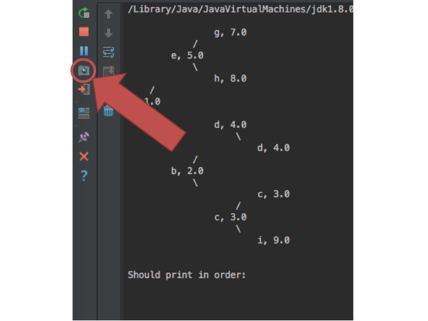
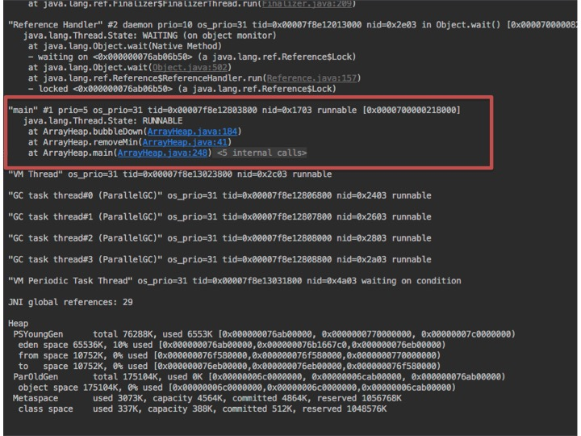
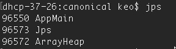
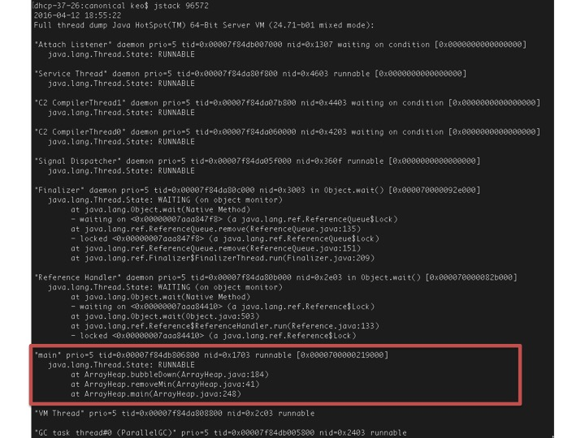
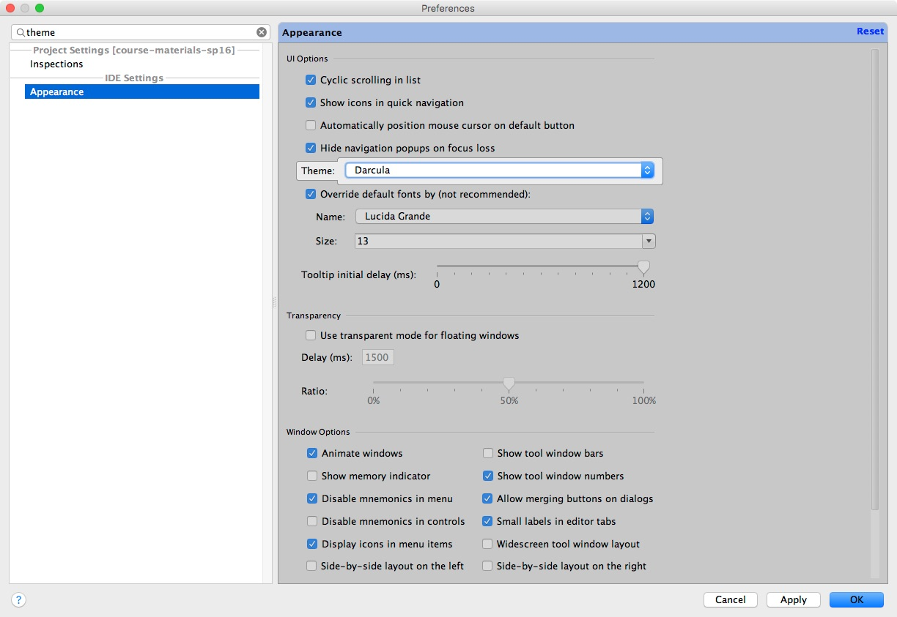

# CS61B Tips and Tricks

## 4/4/16: Quickly finding infinite loops

After a long tip hiatus due to midterm 2 and Spring Break, this week's tip is life-changing!  One common issue you'll run into is that you've written code that has an infinite loop.  In the past, you've probably debugged infinite loops using print-statement debugging: you add a bunch of print statements to your code to determine where the infinite loop is occurring.  This week's tip is a *much faster* way to determine where your code is stuck in an infinite loop.

Suppose you've run a program that's stuck in an infinte loop.  First, I'll show how to use IntelliJ to debug infinite loops.  As an example, I'll run a buggy implementation of the `ArrayHeap` from lab 10.  My implementation has an infinite loop, so when I run `ArrayHeap`'s main method, it hangs after printing the original heap.  To figure out where the infinite loop is, I can click the camera icon that's at the left side of IntelliJ's "run" view (shown in the red circle below):

This causes IntelliJ to output a [stack trace](https://en.wikipedia.org/wiki/Stack_trace) for each thread that's currently running.  You'll see a bunch of output that looks like foreign goop (these are various background threads that the Java virtual machine has running), but you should see one block of output that looks familiar.  The familiar thread is shown in a red box below:

From this thread, I can see that my `ArrayHeap` program is currently at line 184 of `ArrayHeap.java` (from the stack trace, I can also see that this is in the `bubbleDown` method, which was called by the `removeMin` method, which was called by the `main` method).  Since my code has an infinite loop, if I output the stack trace again, I'd see that my code was still in the same spot.  If I go to that line (which I can conveniently do by clicking on the blue "ArrayHeap.java:184" in the stack trace -- thanks IntelliJ!), that's where my infinite loop is!

You don't need to be using IntelliJ to get this nifty stack trace.  If you've run your program some other way (e.g., from the command line), you can use the `jstack` command to get a stack trace.  First, you'll need to figure out the ID of your Java process.  To do this, run the `jps` command, which lists all Java processes that are currently running:

I have a couple of Java programs running on my computer (you can see that `jps` is itself a Java program!), but the one I'm looking for is `ArrayHeap`.  From this output, I can see that the `ArrayHeap` program has process ID 96572.  Now, I can call `jstack` with this process ID to get a stack trace of the `ArrayHeap` program:

This output is similar to the stack trace from IntelliJ, and again there's one familiar block (shown in a red box) that has the stack trace for my `ArrayHeap` program.

You can use these stack trace tools anytime you'd like to see what line your Java program is currently executing!  They're especially useful for finding infinite loops, but they can be useful other times too.  For example, they show what locks have been acquired by each thread, which can be useful for debugging deadlocks (more about that in 61C!).

## 2/22/16: Finding where functions and variables are used in IntelliJ

Last week, we learned that you can use IntelliJ to quickly navigate to where a function or variable was declared.  This week, we'll do the opposite: if you right click on the name of a variable or function, you can select "Find Usages" to find all of the places where that function or variable is used.  You can do this by right clicking on the function or variable name in the place where it is declared, or by right clicking on the name in a place where the function or variable is used. This feature is often useful if you're changing something about a function, and you want to look at all of the places the function is used to make sure you don't need to change anything about the way the function is called.

## 2/22/16: Finding definitions in IntelliJ

One of the most useful features of IntelliJ is that it allows you to quickly look up where functions and variables are defined.  If you hold down the shortcut key (the command key on Mac and the control key on Windows) while clicking on a varible in IntelliJ, IntelliJ will take you to where that variable is declared.  Similarly, if you hold down the shortcut key while clicking on the name of a function, IntelliJ will take you to where that function is declared. This trick should save you from spending lots of time scrolling through files, trying to find where you defined a particular function or variable!

## 2/15/16: Code Small

This week's tip was about how to avoid debugging-hell with large projects by writing as little code as possible before testing to see if the code works.  It's described in more detail in the [introduction of the project 2 spec](http://cs61b.ug/sp16/materials/proj/proj2/proj2.html#introduction).

## 2/8/16: Style Tip: Changing IntelliJ's Color Scheme

As you've been using IntelliJ in class, you may have been wishing that IntelliJ used a color scheme with a black background, like Josh has set up Sublime to use in lecture.  To change IntelliJ to use a dark background, navigate to IntelliJ's preferences window.  For Mac users, this is under the IntelliJ menu at the top (for some users, it may be called "Settings" instead of "Preferences").  In the search bar at the top, type "theme".  You should see an entry pop up that's called "Appearance". Click "Appearance" and then next to "Theme:", change "Default" to "Darcula". You may need to re-start IntelliJ for the changes to take effect.

## 2/1/16: Never Retype: Up Arrow and Ctrl+R

This week we'll learn two tricks to avoid re-typing commands you've already used.  The first is the up arrow.  Typing the up arrow in Bash will always bring up the previous command you entered.  For example, suppose I tried to add a link to our class's skeleton repository, but I accidentally mispelled it:

<pre>
$ git remote add skeleton https://github.com/Berkeley-CS61B/skeeeton-sp16.git
</pre>

When git gives me an error, it's going to be annoying to retype the entire command (with the typo fixed).  Instead, you can just press the up arrow, and then modify the last part of the command to eliminate the typo.

The second, and more powerful trick, is using Control+r.  If you type Control+r (the control key and the "r" key at the same time), Bash will enter reverse search mode.  In this mode, you can start typing any part of a command you've used in the last, and Bash will autocomplete to the most recent command that had the string you typed as a substring.  If you press Control+r again, Bash will keep going backwards in history to the previous matching command.  For example, suppose I type Control+r and then type "pull":

<pre>
(reverse-i-search)`pull': git pull skeleton master
</pre>

Bash autocompletes to the most recent command I typed that included "pull", which in this case was a git command to pull the latest skeleton code.

## 1/25/16: Tab Completion

One of the most useful Bash tricks is tab completion.  You'll often find yourself typing a filename in the terminal; for example, to add a file to git.  If you start typing a filename and then press Tab, Bash will automatically complete the filename for you based on what's in the directory.  Suppose I have a bunch of long filenames in my current directory:

<pre>
$ ls
another_filename_that_is_also_long         
another_really_long_filename_that_is_even_longer
really_long_filename
</pre>

If I want to add `really_long_filename` to git, I can start typing the filename:

<pre>
$ git add rea
</pre>

and then press Tab, and bash will fill this in to:

<pre>
$ git add really_long_filename
</pre>

What if I press Tab after entering in an ambiguous prefix? For example, suppose I type

<pre>
$ git add an
</pre>

and then press Tab.  In this case, Bash will fill in as much as it can:

<pre>
$ git add another_
</pre>

but then stops, because it doesn't know which of the files beginning with `another_` I'm trying to type.  If I press Tab a second time, Bash will list the possible files:

<pre>
$ git add another_
another_filename_that_is_also_long
another_really_long_filename_that_is_even_longer
</pre>

Now I can continue typing the filename (e.g., adding an `f` to add `another_filename_that_is_also_long`) and press Tab again.

This trick also works with commands! Suppose you've forgotten what language we're using in this class, so you can't remember how to run your program (is it `java` or `jabba`???).  If you start typing the name of the command and then press Tab, Bash will show you all of the options:

<pre>
$ ja
jadetex         jar             java            javadoc         javah           javaws          jamo-normalize  jarsigner       javac           javafxpackager  javap 
</pre>

This tip was inspired by a page on [How-To Geek](http://www.howtogeek.com/110150/become-a-linux-terminal-power-user-with-these-8-tricks/) that you can check out for more tips!

